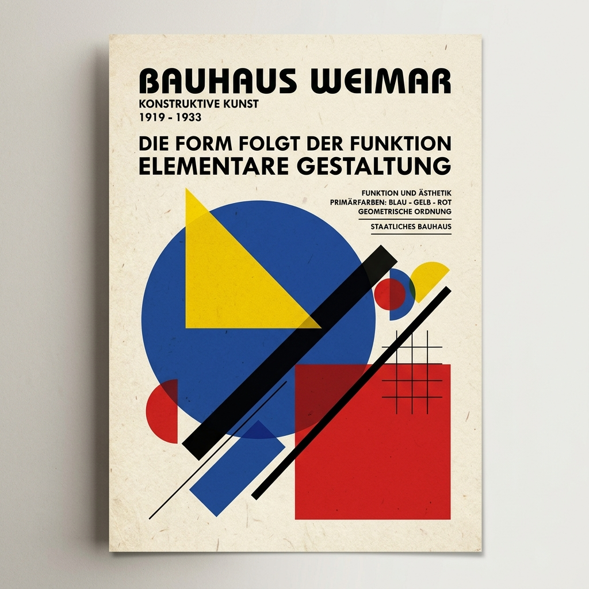

# V.GRAPHIKS | Design Que Fala

**V.GRAPHIKS** is a premium graphic design studio portfolio built with a focus on high-end aesthetics, smooth interactions, and a "Bauhaus-inspired" design language.



## 🚀 Overview
This project showcases a modern, responsive design portfolio for a graphic design studio based in Lisboa, Portugal. It features advanced animations, a custom interaction system, and a clean, geometric visual identity.

## 🛠️ Technologies Used
- **Frontend Core**: HTML5, Vanilla JavaScript (ES6+)
- **Styling**: CSS3 (Vanilla CSS with Custom Properties)
- **Animations**: [GSAP (GreenSock Animation Platform)](https://greensock.com/gsap/) for high-performance scroll and entrance animations.
- **Smooth Scrolling**: [Lenis](https://github.com/studio-freight/lenis) for a premium, cinematic scrolling experience.
- **Build Tool**: [Vite](https://vitejs.dev/) for ultra-fast development and optimized production builds.
- **Fonts**: Google Fonts (Syne & Inter).

## ✨ Key Features
- **Custom Cursor System**: A smart cursor that reacts to interactive elements (magnetic effect, scaling, and blending modes).
- **Preloader Animation**: A brand-focused entrance with progress tracking.
- **Dynamic Reveal Animations**: Character-by-character text splitting and scroll-triggered content reveals.
- **Interactive Services Section**: Floating image reveal effect that follows the cursor on service hover.
- **Responsive Design**: Fully optimized for mobile, tablet, and desktop views.
- **Real-time Clock**: A digital clock synchronized with the user's local time.
- **Stat Counters**: Animated counting logic for studio metrics.

## 📦 Installation & Setup

1. **Clone the repository**:
   ```bash
   git clone https://github.com/diogoduarte2000/V.GRAPHIKS.git
   ```

2. **Install dependencies**:
   ```bash
   npm install
   ```

3. **Run in development mode**:
   ```bash
   npm run dev
   ```

4. **Build for production**:
   ```bash
   npm run build
   ```

## 🎨 Design Philosophy
Inspired by the **Bauhaus** movement, the site uses a primary color palette (Blue, Red, Yellow) against a cream background (`#fcfaf1`). The layout prioritizes geometric precision and the intersection of "Form and Function".

---
© 2026 v.graphiks — Todos os direitos reservados.
